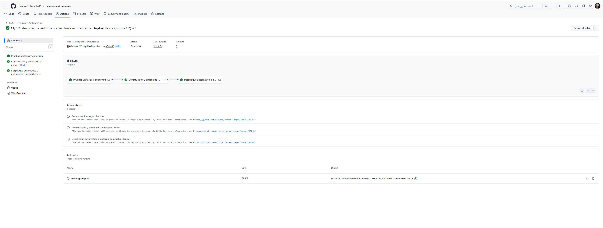
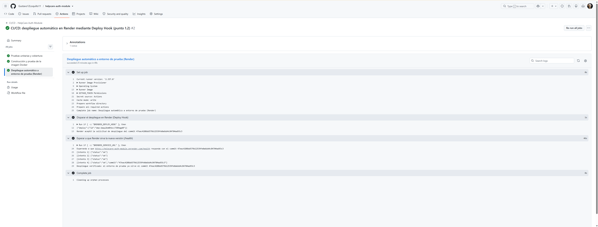
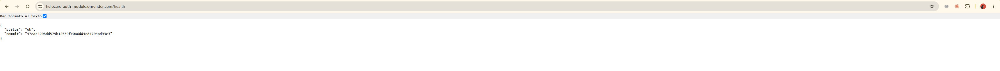

# Evidencia — Punto 1.2: Pipeline CI/CD con despliegue automático

- **Repositorio:** https://github.com/Gustavo12Loquillo11/helpcare-auth-module
- **Pipeline:** `.github/workflows/ci-cd.yml` (GitHub Actions)
- **Entorno de prueba:** Render, Web Service `helpcare-auth-module` (plan gratuito)
- **URL pública:** https://helpcare-auth-module.onrender.com
- **Fecha:** 24/09/2026

## Ejecución verificada

Ejecución #2, disparada automáticamente por el `git push` del commit
`47eac42` a `main`:
https://github.com/Gustavo12Loquillo11/helpcare-auth-module/actions/runs/36087830509

| Etapa | Job                                                | Resultado | Duración |
|-------|----------------------------------------------------|-----------|----------|
| 1     | Pruebas unitarias y cobertura                      | ✅ Éxito  | 12 s     |
| 2     | Construcción y prueba de la imagen Docker          | ✅ Éxito  | 15 s     |
| 3     | Despliegue automático a entorno de prueba (Render) | ✅ Éxito  | 49 s     |

Duración total: 1 min 27 s. Artefacto publicado: `coverage-report`.

### Extracto del log del job de despliegue

```
Disparar el despliegue en Render (Deploy Hook)
  {"deploy":{"id":"dep-daqu2km0tbcc7389agd0"}}
  Render aceptó la solicitud de despliegue del commit 47eac4208dd579b12539fe0a6dd4c84704ad93c3

Esperar a que Render sirva la nueva versión (/health)
  Esperando a que https://helpcare-auth-module.onrender.com/health responda con el commit 47eac4208dd579b12539fe0a6dd4c84704ad93c3
  [intento 1] {"status":"ok"}
  [intento 2] {"status":"ok"}
  [intento 3] {"status":"ok"}
  [intento 4] {"status":"ok","commit":"47eac4208dd579b12539fe0a6dd4c84704ad93c3"}
  Despliegue verificado: el entorno de prueba ya sirve el commit 47eac4208dd579b12539fe0a6dd4c84704ad93c3
```

Los intentos 1 a 3 muestran la versión anterior (aún sin el campo `commit`)
mientras Render construía; en el intento 4 el entorno ya servía el commit
recién subido.

### Respuesta del servicio desplegado

```
GET https://helpcare-auth-module.onrender.com/health  →  HTTP 200
{"status":"ok","commit":"47eac4208dd579b12539fe0a6dd4c84704ad93c3"}
```

## Pruebas locales previas (paso 1 de las instrucciones)

`npm test` con Node 24.21.0: 7 suites, 27 pruebas, todas en PASS.

| Métrica    | Cobertura | Umbral |
|------------|-----------|--------|
| Sentencias | 97.50 %   | 80 %   |
| Ramas      | 92.72 %   | 80 %   |
| Funciones  | 95.83 %   | 80 %   |
| Líneas     | 97.43 %   | 80 %   |

`npm run lint`: sin errores ni advertencias.

## Configuración

- **GitHub → Settings → Secrets and variables → Actions**
  - Secret `RENDER_DEPLOY_HOOK`: URL del Deploy Hook de Render (no se
    muestra en los logs; GitHub la enmascara).
  - Variable `RENDER_SERVICE_URL`: `https://helpcare-auth-module.onrender.com`.
- **Render:** runtime Node (versión desde `.node-version`),
  `Build Command: npm install`, `Start Command: npm start`,
  `Health Check Path: /health`, Auto-Deploy en `Off` (solo despliega el
  pipeline), variable `JWT_SECRET` generada aleatoriamente por Render.

## Capturas

### 1. Pipeline en verde (test → build → deploy)



### 2. Log del job de despliegue con la verificación



### 3. Servicio desplegado respondiendo en la URL pública


